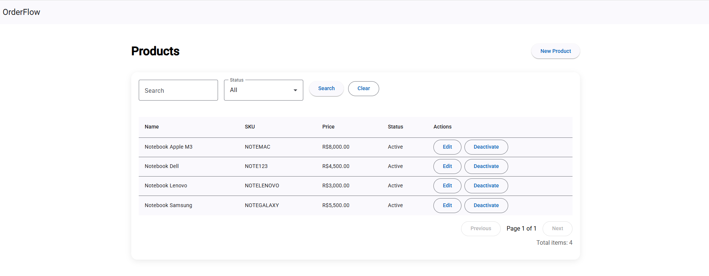
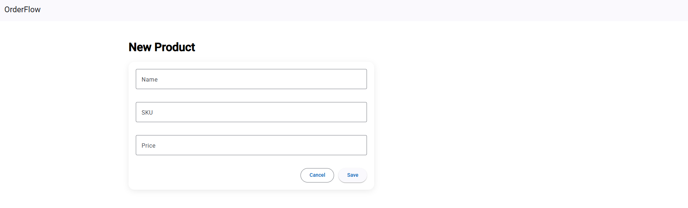
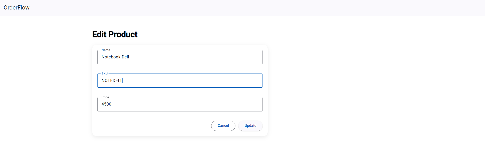

# OrderFlow

A clean architecture ASP.NET Core Web API for product management, built with .NET 8 and PostgreSQL.

---

## 🇺🇸 English

### 📌 Overview

OrderFlow is a backend API designed to demonstrate clean architecture principles, domain-driven structure, and professional software engineering practices.

It implements a complete CRUD for Products with:

- Pagination
- Filtering
- Soft delete
- Global exception handling
- Unit tests
- CI pipeline with GitHub Actions

---

### 🏗 Architecture

The project follows a layered architecture:

- **Domain** → Core business rules and entities  
- **Application** → UseCases and business orchestration  
- **Infrastructure** → EF Core, PostgreSQL, repository implementations  
- **API** → Controllers, Middleware, Dependency Injection  

This structure enforces separation of concerns and testability.

---

### 🚀 Tech Stack

- .NET 8
- ASP.NET Core Web API
- Entity Framework Core
- PostgreSQL (Docker)
- xUnit
- GitHub Actions (CI)
- Clean Architecture

---

### 🐳 Running with Docker

Make sure Docker is running.

Start PostgreSQL:

```bash
docker compose up -d
```

Apply migrations:
```
dotnet ef database update --project ./backend/OrderFlow.Infrastructure --startup-project ./backend/OrderFlow.Api
```

Run the API:
```
dotnet run --project ./backend/OrderFlow.Api
```

The Swagger wiil be available at:
```
http://localhost:5082/swagger
```

Running Tests:
```
dotnet test
```

CI runs automatically on push via GitHub Actions.

---

📦 API Endpoints
- Method	Endpoint	Description
- POST	/api/products	Create product
- GET	/api/products	List with pagination & filters
- GET	/api/products/{id}	Get by id
- PUT	/api/products/{id}	Update product
- DELETE	/api/products/{id}	Soft delete (deactivate)

Query parameters for listing:

- search
- active
- page
- pageSize


--- 


### 💻 Frontend

- Angular
- Angular Material

Run the frontend:

```bash
cd frontend
npm install
ng serve
```

The application will be available at:

```
http://localhost:4200
````

---

### 📸 Screenshots

#### Product List


#### Create Product


#### Edit Product


--- 

🎯 Why this project?

This project demonstrates:

- Clean separation of layers

- Business rule enforcement in Domain

- UseCase-driven architecture

- Proper HTTP semantics

- Automated testing

- CI pipeline

- It is structured to reflect production-ready backend practices.

---

👨‍💻 Author

Developed as a portfolio project to demonstrate backend engineering practices.

---
## 🇧🇷 Português

### 📌 Visão Geral

OrderFlow é uma API backend desenvolvida para demonstrar arquitetura limpa, organização em camadas e boas práticas profissionais com .NET 8.

O projeto implementa CRUD completo de Produtos com:

- Paginação

- Filtros

- Soft delete

- Middleware global de exceção

- Testes unitários

- Pipeline CI com GitHub Actions

---

🏗 Arquitetura

O projeto segue separação por camadas:

- Domain → Regras de negócio

- Application → Casos de uso

- Infrastructure → Acesso a dados (EF + PostgreSQL)

- API → Controllers e configuração

- Essa organização facilita manutenção, testes e evolução.

---

🚀 Tecnologias

- .NET 8

- ASP.NET Core Web API

- Entity Framework Core

- PostgreSQL (Docker)

- xUnit

- GitHub Actions

- Clean Architecture

---

### 🐳 Rodando com Docker

Certifique-se de que o Docker esteja rodando.

Subir o PostgreSQL:

```bash
docker compose up -d
```

Aplicar as migrations:
```
dotnet ef database update --project ./backend/OrderFlow.Infrastructure --startup-project ./backend/OrderFlow.Api
```
Rodar a API:
```
dotnet run --project ./backend/OrderFlow.Api
```

O Swagger estará disponível em:
```
http://localhost:5082/swagger
```

Executando os testes:
````
dotnet test
````
---

📦 Endpoints principais

- Criar produto

- Listar produtos (com paginação e filtros)

- Buscar por ID

- Atualizar produto

- Desativar produto (soft delete)

---

### 💻 Frontend

- Angular
- Angular Material
  
Rodar o frontend:
```markdown

cd frontend
npm install
ng serve
````
A aplicação estará disponível em:
```
http://localhost:4200
```
---
### 📸 Imagens do sistema

#### Lista de produtos


#### Cadastro de produto


#### Edição de produto


---

👨‍💻 Autor

Portifólio desenvolvido para demonstrar práticas de backend.
